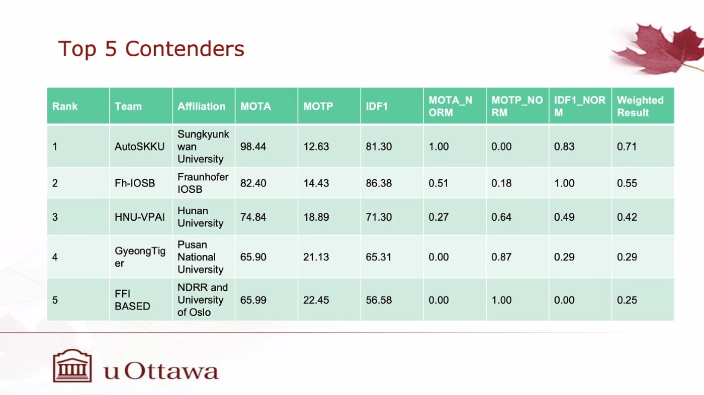

# PBVS 2025 - Thermal Pedestrian Multiple Object Tracking Challenge (TP-MOT)

## Automation Lab, Sungkyunkwan University

## Team: AutoSKKU

### Winner of PBVS 2025 - Thermal Pedestrian Multiple Object Tracking Challenge (TP-MOT)



---

#### I. Installation

1. Download & install Miniconda or Anaconda from https://docs.conda.io/projects/conda/en/latest/user-guide/install/linux.html


2. Open new Terminal, create new conda environment named **pbvs25_mot** and activate it with following commands:

```shell
conda create --name pbvs25_mot python=3.10

conda activate pbvs25_mot

bash setup.sh
```

---


#### II. Data preparation

##### a. Data download

Go to the website of PBVS Thermal MOT Challenge to get the dataset.

- https://pbvs-workshop.github.io/challenge.html

##### b. Video data import

Add video files to **pbvs25_tp-mot/data**.

The program folder structure should be as following:

```
pbvs25_tp-mot
├── data
│   ├──tmot_dataset
...
```

---

#### III. Reference

##### a. Check weight

Download weight from release of github [release](https://github.com/DuongTran1708/pbvs25_tp-mot/releases/tag/v0.1)

The folder structure should be as following:
```
pbvs25_tp-mot
├── models_zoo
│   ├──pbvs25_tmot
│   │   ├──pbvs25_tmot_v1_1920
│   │   │   ├──weight
│   │   │   │   └──best.pt
```

Or you can download more weights from the link [release](https://github.com/DuongTran1708/pbvs25_tp-mot/releases/tag/v1.0)

##### b. Run inference

And the running script to get the result

```shell
bash script/run_track_pbvs25_thermal_mot_official.sh 
```

##### c. Get the result
After more than 5-10 minutes, we get the result:
```
pbvs25_tp-mot
├── data
│   ├──tmot_dataset
│   │   ├──output_pbvs25
```

#### IV. Citation

```
@misc{tran2025noveltuningmethodrealtime,
      title={A Novel Tuning Method for Real-time Multiple-Object Tracking Utilizing Thermal Sensor with Complexity Motion Pattern}, 
      author={Duong Nguyen-Ngoc Tran and Long Hoang Pham and Chi Dai Tran and Quoc Pham-Nam Ho and Huy-Hung Nguyen and Jae Wook Jeon},
      year={2025},
      eprint={2507.02408},
      archivePrefix={arXiv},
      primaryClass={cs.CV},
      url={https://arxiv.org/abs/2507.02408}, 
}
```

#### V. Acknowledgement

Most of the code is adapted from [Mon](https://github.com/phlong3105/mon). 

This repository also features code from 
[Ultralytics](https://github.com/ultralytics/ultralytics),  
[Torchreid](https://github.com/KaiyangZhou/deep-person-reid), 
[DiffMOT](https://github.com/Kroery/DiffMOT), 
[BoostTrack](https://github.com/vukasin-stanojevic/BoostTrack),
and [TrackEval](https://github.com/JonathonLuiten/TrackEval).  